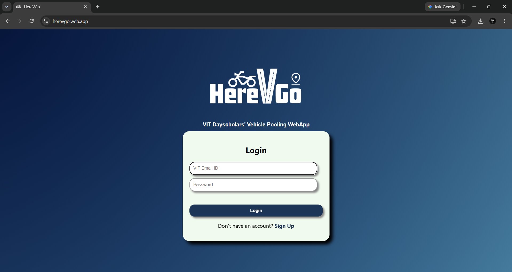
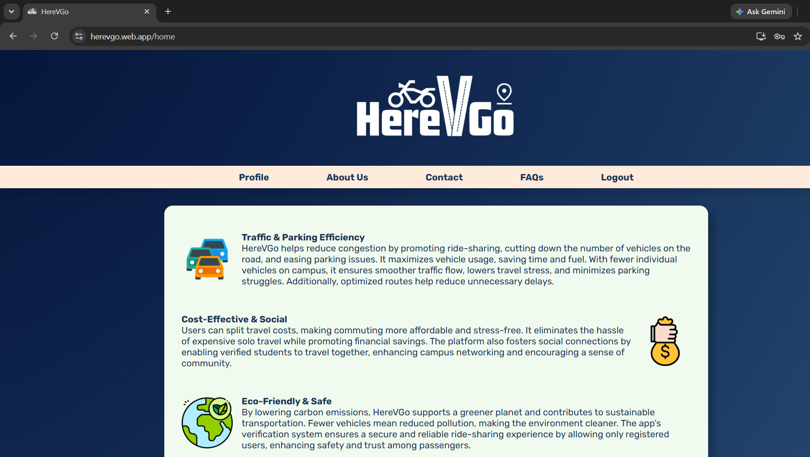
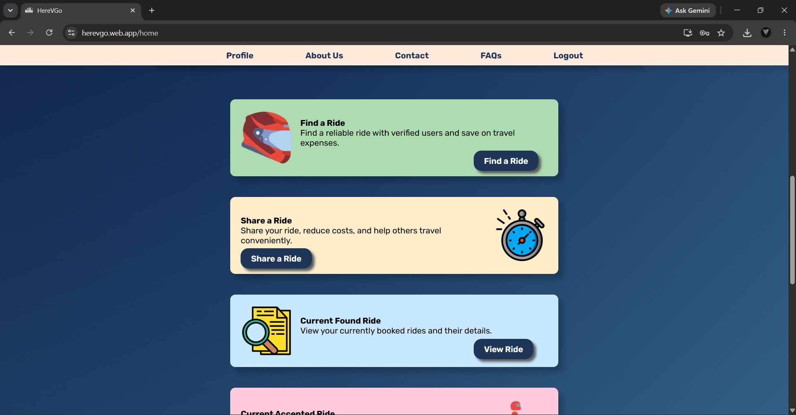
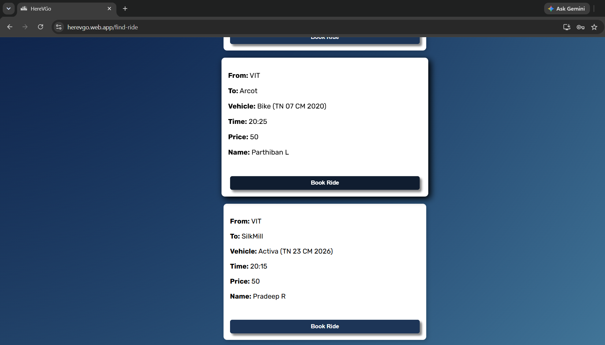
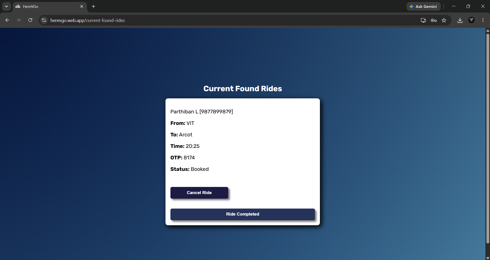

# HereVGo - Ride-Sharing Web Application

A ride-sharing platform developed for day scholars to enable affordable and sustainable daily commutes. The application allows users to either share rides or find available rides through a simple and responsive web interface.

## Live Demo

https://herevgo.web.app

## Features

* User authentication using Firebase
* Ride creation and management
* Ride discovery and booking
* OTP-based ride verification
* Responsive user interface
* Cloud-based data storage using Firebase

## Tech Stack

### Frontend

* React.js
* JavaScript
* HTML
* CSS

### Backend & Services

* Firebase Authentication
* Firebase Realtime Database / Firestore

## Project Workflow

Consider two users: **A** and **B**.

1. User A shares a ride.
2. User B searches for available rides.
3. User B selects A's ride.
4. The selected ride appears under **Current Found Rides** for B.
5. User A can view the booking under **Current Booked Rides**.
6. An OTP exchange is used for ride verification.

## Screenshots

## Screenshots

| Login Page                      | Home Page                        |
| ------------------------------- | -------------------------------- |
|  |  |

| Ride Overview                    | Share Ride Page                      |
| -------------------------------- | ----------------------------------- |
|  |  |

| Ride Details Page                      |
| -------------------------------------- |
|  |

## Key Highlights

* Developed a responsive frontend using React.js
* Integrated Firebase Authentication for secure user access
* Utilized Firebase for cloud-based data storage
* Implemented ride booking and OTP-based verification workflows
* Designed to support cost-effective and sustainable student commuting

## Limitations & Future Scope

The current version focuses on demonstrating the core ride-sharing workflow. Features such as user verification, payment integration, in-app messaging, live location tracking, and rewards can be incorporated to further improve usability and trust.

## Demo Notes

For demonstration purposes, sample VIT email IDs may be used instead of personal accounts. Both ride sharing and ride finding can be performed using the same account to showcase the application's functionality.
